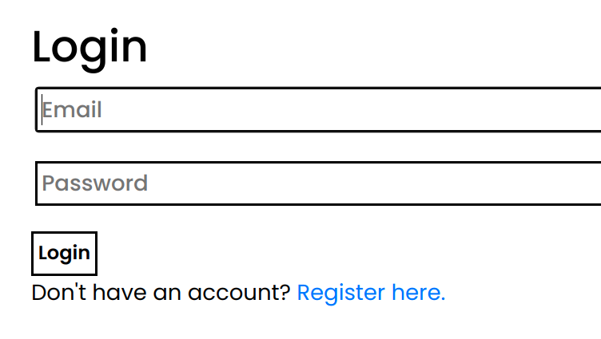

# MAIL

## <a href="https://mail-cs50web.herokuapp.com/">Project is live!</a>

https://mail-cs50web.herokuapp.com/

## <a href="https://youtu.be/M5tJ41DYPE0">Submission video</a>

### cs50web Project

### <b>Features:</b>

    <ul>
        <li>inbox page</li> 
        <li>compose page</li> 
        <li>sent page</li> 
        <li>archive Page</li> 
        <li>mail body Page</li> 
            <ul>
                <li>complete information</li>
                <li>proper time in user's timezone</li>
                <li>body with newline preserved</li>
                <li>Archive button and reply button</li>
            </ul>
        <li>Archive functionality</li>
        <li>reply functionality</li>
    </ul>

### <b>Images:</b>

Inbox (same for sent and archive, but with specific mails)

Email body page

compose page

Login page
 

 
register page
 

